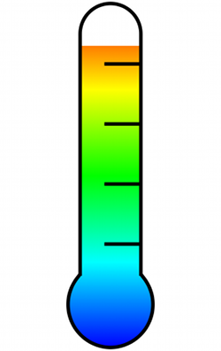

## MAThermoter

MAThermometer is a custom progress bar with a thermometer look. You can use it as a progress bar or to display temperature data. This custom view doesn’t use any image, so you can use in any size you want.

----

**How to use it** 
MAThermometer is a UIView subclass, so you can use it from interface builder or programmatically with the `initWithFrame` method. 
You can then customize the Thermometer using the following properties : curValue, minValue, maxValue, darkTheme.

**Licence**
MAThermometer is under MIT Licence so you can use/modify it as you wish. Any feedback will be appreciated.

Any comments are welcomed 

@micazeve
micazeve@gmail.com