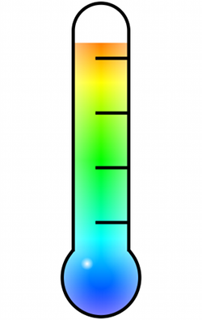

## MAThermoter

MAThermometer is a custom progress bar with a thermometer look. You can use it as a progress bar or to display temperature data. This custom view doesn’t use any image, so you can use in any size you want.

----

**How to use it :** 
Import MAThermometer and MAThermometerBorder class within your project. You have to create only MAThermometer instances. MAThermometer is a UIView subclass, so you can use it from interface builder or programmatically with the `initWithFrame` method. 
You can then customize the Thermometer using the following properties : curValue, minValue, maxValue, darkTheme and glassEffect.
You can also choose the colors to display with the arrayColors property.

**Compatibility:** 
MAThermometer use CGContext methods and should be available on iOS2+ devices. It has been tested on iPhone 3GS under iOS 6.1.6 and iPhone 5S under iOS 7.1.1.

**Licence :**
MAThermometer is under MIT Licence so you can use/modify it as you wish. Any feedback will be appreciated.

Any comments are welcomed 

@micazeve
micazeve@gmail.com